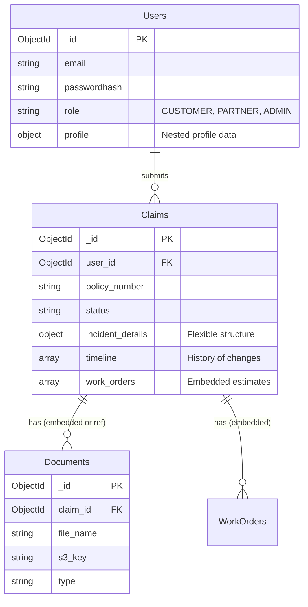

# Database Schema Design - MongoDB (NoSQL)

## 1. Overview
The solution uses **MongoDB**. Unlike Relational DBs, we design for **Access Patterns** (Query-first design). We will use **Embedded Documents** where data is frequently accessed together, and **References** where data grows unbounded.

## 2. Collection Relationships (Crow's Foot notation for Conceptual View)



## 3. Document Models (BSON)

### A. `users` Collection
Stores authentication and profile info.
```json
{
  "_id": "ObjectId('...')",
  "email": "customer@example.com",
  "roles": ["CUSTOMER"],
  "profile": {
    "firstName": "John",
    "lastName": "Doe",
    "phone": "+1234567890"
  },
  "createdAt": "ISODate('...')"
}
```

### B. `claims` Collection
The aggregate root. Contains most data needed to render a "Claim Details" page.
```json
{
  "_id": "ObjectId('...')",
  "userId": "ObjectId('Ref to Users')",
  "status": "IN_REVIEW",
  "policyNumber": "POL-998877",
  "incident": {
    "date": "ISODate('...')",
    "description": "Fender v fender",
    "location": { "lat": 40.7, "long": -73.9 }
  },
  "workOrders": [
    {
      "providerId": "ObjectId('Ref to Partner')",
      "estimateAmount": 500.00,
      "status": "APPROVED"
    }
  ],
  "auditLog": [
    { "action": "SUBMITTED", "date": "...", "by": "user" },
    { "action": "ASSIGNED", "date": "...", "by": "system" }
  ]
}
```

### C. `documents` Collection
kept separate to avoid hitting 16MB BSON limit if metadata grows, or to allow searching docs independently.
```json
{
  "_id": "ObjectId('...')",
  "claimId": "ObjectId('Ref to Claims')",
  "type": "POLICE_REPORT",
  "storagePath": "/s3/bucket/key.pdf",
  "uploadedAt": "ISODate('...')"
}
```

## 4. Design Decisions
1.  **Embedding `workOrders`**: Work orders are tightly coupled to a claim and rarely accessed in isolation from the claim context (except by the partner, who can query claims where `workOrders.providerId == Me`).
2.  **Referencing `Documents`**: While metadata is small, we keep them distinct to allow a global "Document Management" view for auditors without unwinding Claim arrays.
3.  **Referencing `Users`**: Users exist independently of claims.
