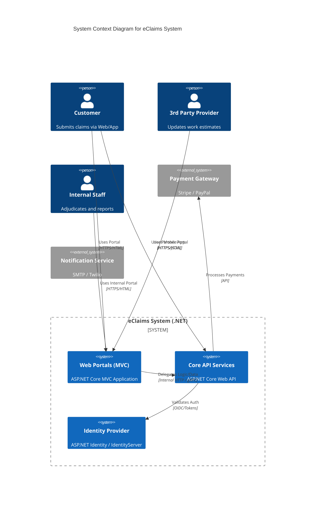
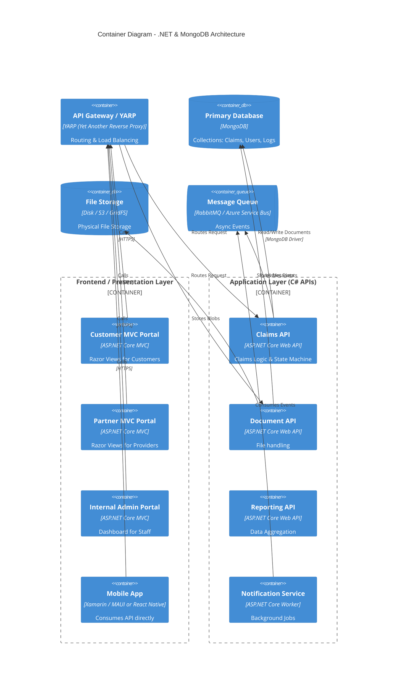

# High-Level Design (HLD) - eClaims System

## 1. Solution Overview
The eClaims System is designed as a **Service-Oriented Architecture (SOA)** or **Microservices** solution using the **Microsoft .NET Ecosystem**.
*   **Web Portals**: Built using **ASP.NET Core MVC** (Server-Side Rendering) for robust SEO and traditional web workflows.
*   **Mobile & Partner APIs**: Exposed via **ASP.NET Core Web APIs**.
*   **Data Layer**: **MongoDB** (NoSQL) for flexible schema handling of claims and metadata.

## 2. System Context Diagram (C4 Level 1)

## 3. Container Diagram (C4 Level 2)

## 4. Key Components

### A. ASP.NET Core MVC (Portals)
Each portal (Customer, Partner, Internal) can be a separate Area within a single modular Monolith OR separate deployable MVC apps.
*   **Controller**: Handles UI logic and View returning.
*   **Service Agent**: Calls the backend APIs (separation of concerns).

### Sequence Diagrams

A sequence diagram for the primary Claim submission flow has been added: architecture/sequence/claim_submission.puml

### B. MongoDB Data Model
Leverage the schema-less nature for **Claims**.
*   A "Claim" document can embed "Estimates" and "Notes" directly, avoiding complex joins.
*   Polymorphism is easy: `CarAccidentClaim` vs `HomeClaim` can coexist in the same collection.

### C. Authentication
*   **ASP.NET Core Identity** storing users in MongoDB.
*   **JWT Bearer Tokens** for API communication.

## 5. Technology Stack
*   **Frontend Web**: ASP.NET Core 8 MVC (Razor).
*   **Mobile**: (Choice of User) consuming C# API.
*   **Backend API**: C# / ASP.NET Core Web API.
*   **Database**: MongoDB (v6+).
*   **Documentation**: Swagger/OpenAPI.
